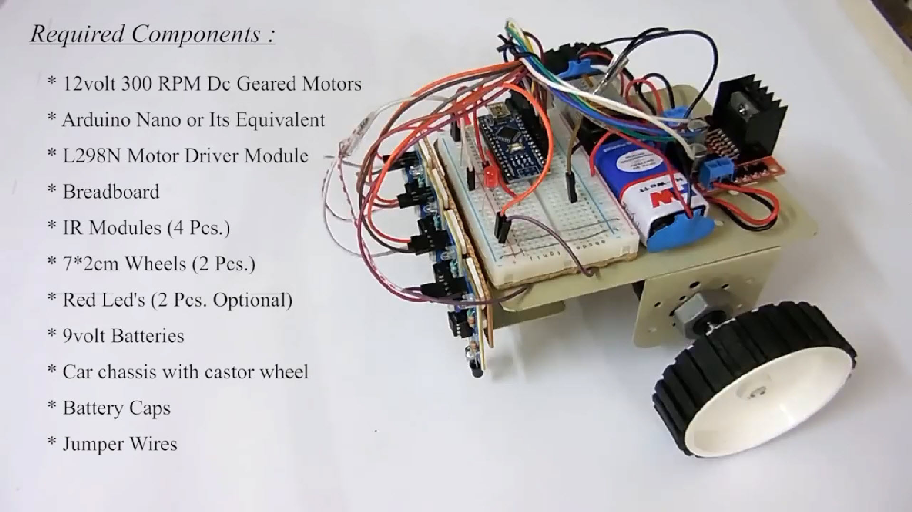
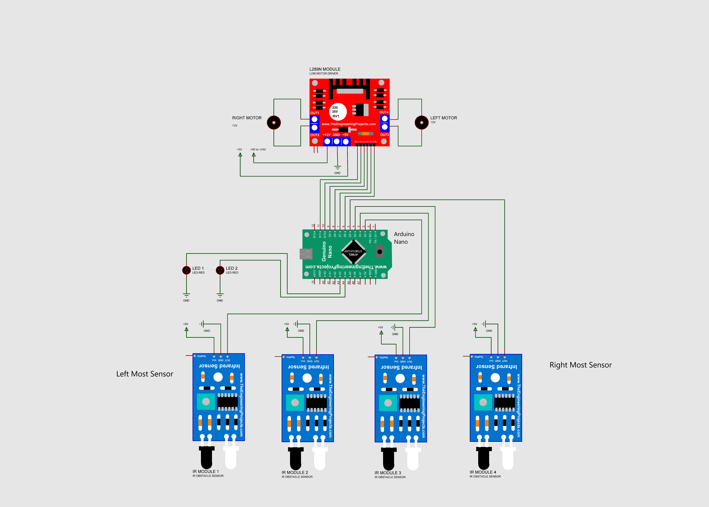
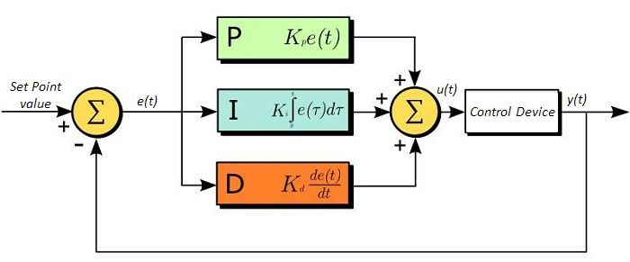

# Robot Line Follower menggunakan ARDUINO

Membuat Robot Line Follower menggunakan ARDUINO & PID, 4 Sensor dan 2 Motor.

## Siapkan Komponen

  

## Buat Mekanik Robot

  

## Buat Mekanik Rangkaian

  

## Upload Program Arduino
Upload Program Arduino dan lakukan Kalibrasi Sensor, Motor & PID

  

## Buat Mekanik Rangkaian

  

init